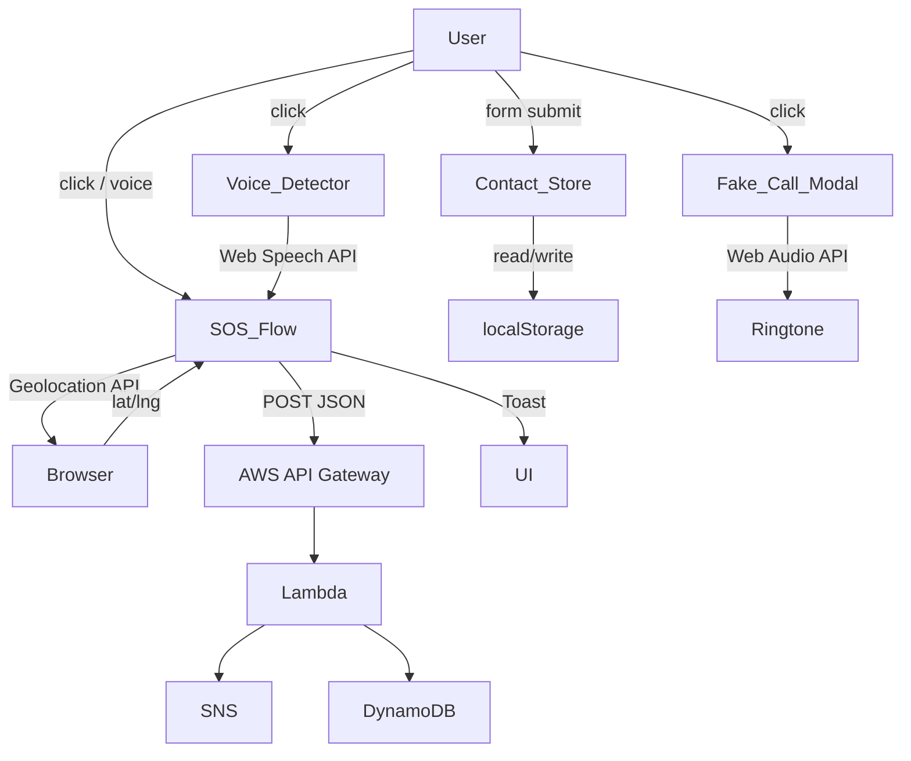

# Design Document — She Shield AI

## Overview

She Shield AI is a single-page web application (SPA) targeting women's safety. It is built as a hackathon-winning demo using only `index.html`, `style.css`, and `script.js` with Bootstrap 5 and Bootstrap Icons as the sole external dependencies.

The design philosophy is **premium-first**: every section should feel like a polished product, not a template. The SOS section is the hero-level visual anchor of the page — it must command attention above everything else.

### Design Goals

- Hackathon-winning visual quality: glassmorphism cards, soft gradients, micro-animations
- SOS section as the dominant visual focus with a pulsing red button and dramatic contrast
- Fully responsive from 320px to 4K using Bootstrap 5 grid
- Zero external libraries beyond Bootstrap 5 + Bootstrap Icons
- All user feedback via Bootstrap Toast notifications
- AWS architecture section that reads as a technical diagram to evaluators

### Premium UI Enhancements (v2)

- Hero: full-screen split layout with floating shield badge, animated tagline, gradient text on app name, decorative blurred orbs in background
- Buttons: pill-shaped with gradient fills, inner glow on hover, icon prefix, subtle border shimmer
- Cards: increased border-radius (20px), stronger glassmorphism, icon in a colored pill badge, gradient top-border accent strip
- Section spacing: 120px vertical padding on desktop, alternating light/white backgrounds with subtle diagonal clip-path dividers
- Fake call modal: dark phone-UI theme, avatar circle, animated ring pulse, green Accept / red Reject pill buttons, caller subtitle "Mobile · Incoming"
- Women safety branding: shield motif in nav brand, empowerment-focused copy, warm rose-gold accent alongside hot pink, trust-building stat badges
- Typography: Google Fonts — "Plus Jakarta Sans" for headings (weight 800), "Inter" for body; loaded via CDN `<link>` in `<head>`
- Micro-interactions: card icon rotates 10deg on hover, button ripple effect on click, nav brand pulse on load

---

## Architecture

The app is a static SPA with no build step. All logic lives in three files:

```
index.html   — markup, Bootstrap 5 CDN, section structure
style.css    — custom design system, animations, glassmorphism
script.js    — all JS modules (SOS, contacts, voice, fake call, counters)
```

### Data Flow



### AWS Architecture (Backend — for evaluators)

```
Browser → S3 (static hosting)
       → API Gateway → Lambda → SNS (SMS/email alerts)
                             → DynamoDB (event log)
```

---

## Components and Interfaces

### 1. Navigation Bar (`#navbar`)

Fixed top Bootstrap 5 navbar with `navbar-expand-md`. Collapses to hamburger below 768px.

Links: Home · Features · Emergency Contacts · Safety Tips · About

Styles: semi-transparent white background with `backdrop-filter: blur(12px)`, pink brand accent, smooth underline hover on links.

### 2. Hero Section (`#home`)

**Premium v2 upgrade:**

Full-viewport-height split layout (60/40 on desktop, stacked on mobile). Left: large bold heading with gradient text effect (`background: linear-gradient(135deg, #e91e8c, #c2185b); -webkit-background-clip: text; color: transparent`), animated tagline with fade-in-up, description, two pill-shaped CTA buttons with icon prefixes. Right: floating shield badge (large `bi-shield-fill-check` icon in a glassmorphism circle with subtle rotation animation), decorative blurred pink/rose-gold orbs in background using `filter: blur(80px)`.

Buttons: "Get Started" (outline with gradient border) and "Trigger SOS" (filled red gradient with inner glow). Both pill-shaped (`border-radius: 50px`), icon prefix (`bi-arrow-right` and `bi-exclamation-triangle-fill`), hover lift + glow.

Background: diagonal pink-white gradient with two decorative blurred orbs (absolute positioned `div` elements with radial gradients and `filter: blur(80px)`).

### 3. Features Section (`#features`)

Six Bootstrap cards in a `row-cols-1 row-cols-md-2 row-cols-lg-3` grid.

**Premium v2 card design:**
- `border-radius: 20px`, stronger glassmorphism (`backdrop-filter: blur(16px)`)
- 4px gradient top-border accent strip (`border-top: 4px solid; border-image: linear-gradient(90deg, #e91e8c, #f48fb1) 1`)
- Icon in a colored pill badge: `width: 56px; height: 56px; border-radius: 14px; background: linear-gradient(135deg, #fce4ec, #f8bbd0)` with icon in `--color-primary`
- On hover: icon rotates 10deg (`transform: rotate(10deg)`), card lifts with stronger shadow
- Card body padding: `1.75rem`

Feature cards:
| Icon | Title |
|------|-------|
| `bi-shield-fill-exclamation` | One Tap SOS Alert |
| `bi-geo-alt-fill` | Live Location Sharing |
| `bi-mic-fill` | Voice Activated Emergency Trigger |
| `bi-telephone-inbound-fill` | Fake Call Escape Feature |
| `bi-person-lines-fill` | Emergency Contacts Storage |
| `bi-lightbulb-fill` | Safety Tips Assistant |

### 4. SOS Emergency Section (`#sos`)

**This is the primary visual focus of the entire page.**

Background: deep radial gradient from `#1a0010` to `#3d0020` — near-black crimson. High contrast against the rest of the page.

Center: a large circular red SOS button (120px diameter on desktop, 96px on mobile) with a multi-layer CSS pulse animation using `@keyframes`. The button has three concentric ring animations at staggered delays.

Below the button: coordinates display (`#sos-coords`) in monospace font, initially hidden.

Loading state: Bootstrap spinner replaces button text during API call.

### 5. Emergency Contacts Section (`#contacts`)

Form with three inputs (Name, Relationship, Phone) and a submit button. Below the form, contacts render as premium glassmorphism cards in a responsive grid. Each card shows name, relationship, phone, and a delete button (`bi-trash3-fill`).

Data persisted to `localStorage` under key `sheShieldContacts`.

### 6. Voice Trigger Section (`#voice`)

"Start Voice Detection" button with a mic icon. When active: button turns pink, a pulsing mic indicator appears, and a status label updates. Uses `window.SpeechRecognition` or `window.webkitSpeechRecognition`.

### 7. Fake Call Section (`#fakecall`)

"Incoming Fake Call" button. Triggers a Bootstrap modal.

**Premium v2 modal design:**
- Modal backdrop: dark blur (`backdrop-filter: blur(8px)`)
- Modal content: dark phone-UI theme (`background: #0d0d0d; border-radius: 32px; border: 1px solid rgba(255,255,255,0.1)`)
- Top: caller avatar circle (80px, gradient pink background, `bi-person-fill` icon in white)
- Caller name: "Mom" in white, weight 700, 1.4rem
- Subtitle: "Mobile · Incoming" in muted gray, 0.85rem
- Animated ring pulse: 3 concentric rings around avatar using `@keyframes ringPulse` (green tint)
- Accept button: pill, green gradient (`#00c853` → `#69f0ae`), `bi-telephone-fill` icon, white text
- Reject button: pill, red gradient (`#ff1744` → `#ff6b6b`), `bi-telephone-x-fill` icon, white text
- Both buttons 56px height, `border-radius: 50px`, side by side

### 8. Safety Tips Section (`#tips`)

Six tip cards in a responsive grid. Each card has a large Bootstrap Icon, a tip title, and a short description. Same glassmorphism card style as Features.

### 9. Stats / Counters Section (`#stats`)

Three stat cards: "Users Protected", "SOS Alerts Sent", "Cities Covered". Counters animate from 0 to target when the section enters the viewport via `IntersectionObserver`. Numbers use large bold typography.

### 10. AWS Architecture Section (`#about`)

Five icon-flow cards in a horizontal scrollable row on mobile, multi-column on desktop. Each card represents one AWS service with a Bootstrap Icon, service name, and one-line description. A connecting arrow (`→`) sits between cards.

Services: S3 → API Gateway → Lambda → SNS → DynamoDB

### 11. Footer (`#footer`)

Dark background, centered content. College challenge info, copyright, and a row of social Bootstrap Icons (GitHub, LinkedIn, Twitter/X, Instagram).

---

## Visual Design System

### Color Palette

```css
--color-primary:       #e91e8c;   /* hot pink — brand accent */
--color-primary-light: #f48fb1;   /* soft pink */
--color-primary-dark:  #c2185b;   /* deep pink */
--color-rose-gold:     #b76e79;   /* rose gold — trust accent */
--color-sos-bg:        #1a0010;   /* near-black crimson — SOS section */
--color-sos-button:    #ff1744;   /* vivid red */
--color-sos-pulse:     rgba(255,23,68,0.4);
--color-white:         #ffffff;
--color-surface:       rgba(255,255,255,0.72);
--color-text-primary:  #1a1a2e;
--color-text-muted:    #6b7280;
--color-border-glass:  rgba(233,30,140,0.18);
--color-accept:        #00c853;   /* fake call accept */
--color-reject:        #ff1744;   /* fake call reject */
```

### Gradients

```css
/* Hero background */
--gradient-hero: linear-gradient(135deg, #fff0f6 0%, #fce4ec 40%, #f8bbd0 100%);

/* Section alternating */
--gradient-section-alt: linear-gradient(180deg, #fff5f9 0%, #ffffff 100%);

/* SOS section — dramatic */
--gradient-sos: radial-gradient(ellipse at center, #3d0020 0%, #1a0010 70%);

/* Card glass */
--gradient-card: linear-gradient(135deg, rgba(255,255,255,0.85), rgba(252,228,236,0.6));

/* Stats section */
--gradient-stats: linear-gradient(135deg, #fce4ec 0%, #f8bbd0 50%, #f48fb1 100%);
```

### Typography

```css
/* Google Fonts — loaded via CDN in <head> */
/* Plus Jakarta Sans: headings | Inter: body */
font-family: 'Inter', -apple-system, BlinkMacSystemFont, sans-serif;

/* Headings */
h1, h2, h3, .display-* { font-family: 'Plus Jakarta Sans', sans-serif; }

/* Scale */
--text-hero-title:  clamp(2.8rem, 7vw, 4.5rem);  font-weight: 800;
--text-section-h2:  clamp(1.8rem, 4vw, 2.5rem);   font-weight: 700;
--text-card-title:  1.1rem;                         font-weight: 600;
--text-body:        1rem;                           font-weight: 400;
--text-stat-number: clamp(2.2rem, 5vw, 3.8rem);    font-weight: 800;

/* Gradient text (hero title) */
.gradient-text {
  background: linear-gradient(135deg, #e91e8c 0%, #c2185b 50%, #b76e79 100%);
  -webkit-background-clip: text;
  -webkit-text-fill-color: transparent;
  background-clip: text;
}
```

### Spacing

8px base unit. Section padding: `padding: 120px 0` on desktop, `padding: 80px 0` on mobile. Card padding: `1.75rem`. Section dividers: alternating `background` with subtle `clip-path: polygon(0 0, 100% 0, 100% 95%, 0 100%)` on select sections for diagonal edge effect.

### Shadows

```css
--shadow-card:       0 4px 24px rgba(233,30,140,0.10), 0 1px 4px rgba(0,0,0,0.06);
--shadow-card-hover: 0 12px 40px rgba(233,30,140,0.22), 0 4px 12px rgba(0,0,0,0.10);
--shadow-sos-button: 0 0 0 0 rgba(255,23,68,0.7);  /* used in pulse keyframe */
--shadow-nav:        0 2px 20px rgba(233,30,140,0.08);
```

### Glassmorphism Card Base (v2)

```css
.glass-card {
  background: var(--gradient-card);
  backdrop-filter: blur(16px);
  -webkit-backdrop-filter: blur(16px);
  border: 1px solid var(--color-border-glass);
  border-radius: 20px;
  border-top: 4px solid transparent;
  background-clip: padding-box;
  box-shadow: var(--shadow-card);
  transition: transform 0.3s ease, box-shadow 0.3s ease;
  position: relative;
  overflow: hidden;
}
/* Gradient top accent strip */
.glass-card::before {
  content: '';
  position: absolute;
  top: 0; left: 0; right: 0;
  height: 4px;
  background: linear-gradient(90deg, #e91e8c, #f48fb1, #b76e79);
  border-radius: 20px 20px 0 0;
}
.glass-card:hover {
  transform: translateY(-8px) scale(1.02);
  box-shadow: var(--shadow-card-hover);
}
/* Icon badge */
.feature-icon-badge {
  width: 56px; height: 56px;
  border-radius: 14px;
  background: linear-gradient(135deg, #fce4ec, #f8bbd0);
  display: flex; align-items: center; justify-content: center;
  font-size: 1.5rem; color: var(--color-primary);
  transition: transform 0.3s ease;
}
.glass-card:hover .feature-icon-badge { transform: rotate(10deg) scale(1.1); }
```

### Button System (v2)

```css
/* Primary pill button — gradient fill */
.btn-shield-primary {
  background: linear-gradient(135deg, #e91e8c, #c2185b);
  color: #fff;
  border: none;
  border-radius: 50px;
  padding: 0.75rem 2rem;
  font-weight: 600;
  font-size: 1rem;
  box-shadow: 0 4px 20px rgba(233,30,140,0.35);
  transition: transform 0.2s ease, box-shadow 0.2s ease, filter 0.2s ease;
}
.btn-shield-primary:hover {
  transform: translateY(-3px);
  box-shadow: 0 8px 32px rgba(233,30,140,0.5);
  filter: brightness(1.08);
  color: #fff;
}

/* Outline pill button */
.btn-shield-outline {
  background: transparent;
  color: var(--color-primary);
  border: 2px solid var(--color-primary);
  border-radius: 50px;
  padding: 0.75rem 2rem;
  font-weight: 600;
  transition: all 0.2s ease;
}
.btn-shield-outline:hover {
  background: var(--color-primary);
  color: #fff;
  transform: translateY(-3px);
  box-shadow: 0 8px 24px rgba(233,30,140,0.35);
}

/* SOS trigger button — red gradient pill */
.btn-sos-trigger {
  background: linear-gradient(135deg, #ff1744, #c62828);
  color: #fff;
  border: none;
  border-radius: 50px;
  padding: 0.75rem 2rem;
  font-weight: 700;
  box-shadow: 0 4px 20px rgba(255,23,68,0.4);
  transition: transform 0.2s ease, box-shadow 0.2s ease;
}
.btn-sos-trigger:hover {
  transform: translateY(-3px);
  box-shadow: 0 8px 32px rgba(255,23,68,0.6);
  color: #fff;
}
```

### SOS Pulse Animation

```css
@keyframes sosPulse {
  0%   { box-shadow: 0 0 0 0 rgba(255,23,68,0.7); }
  70%  { box-shadow: 0 0 0 40px rgba(255,23,68,0); }
  100% { box-shadow: 0 0 0 0 rgba(255,23,68,0); }
}

@keyframes sosRing {
  0%   { transform: scale(1); opacity: 0.8; }
  100% { transform: scale(2.2); opacity: 0; }
}

.sos-btn {
  animation: sosPulse 1.8s infinite;
}
.sos-ring {
  animation: sosRing 1.8s infinite;
}
.sos-ring:nth-child(2) { animation-delay: 0.6s; }
.sos-ring:nth-child(3) { animation-delay: 1.2s; }
```

### Hover Animations (Global)

```css
/* Feature / tip cards */
.feature-card, .tip-card { transition: transform 0.3s ease, box-shadow 0.3s ease; }
.feature-card:hover, .tip-card:hover {
  transform: translateY(-8px) scale(1.02);
  box-shadow: var(--shadow-card-hover);
}

/* Nav links */
.nav-link-custom::after {
  content: '';
  display: block;
  height: 2px;
  background: var(--color-primary);
  transform: scaleX(0);
  transition: transform 0.25s ease;
}
.nav-link-custom:hover::after { transform: scaleX(1); }

/* Nav brand pulse on load */
@keyframes brandPulse {
  0%, 100% { transform: scale(1); }
  50% { transform: scale(1.05); }
}
.navbar-brand { animation: brandPulse 2s ease-in-out 1; }

/* Decorative blurred orbs in hero */
.hero-orb {
  position: absolute;
  border-radius: 50%;
  filter: blur(80px);
  opacity: 0.6;
  pointer-events: none;
}
.hero-orb-1 {
  width: 400px; height: 400px;
  background: radial-gradient(circle, #fce4ec, transparent);
  top: 10%; left: 5%;
}
.hero-orb-2 {
  width: 300px; height: 300px;
  background: radial-gradient(circle, #f8bbd0, transparent);
  bottom: 15%; right: 10%;
}
```

### Responsive Breakpoints

| Breakpoint | Width | Layout changes |
|------------|-------|----------------|
| xs | < 576px | Single column everywhere, SOS button 96px, hero text smaller |
| sm | ≥ 576px | 2-col stats, contact cards 2-up |
| md | ≥ 768px | Nav expands, features 2-col, AWS flow horizontal |
| lg | ≥ 992px | Features 3-col, hero side-by-side possible |
| xl | ≥ 1200px | Max-width container, generous padding |

---

## Data Models

### Contact (localStorage)

```json
{
  "id": "uuid-v4-string",
  "name": "string",
  "relationship": "string",
  "phone": "string"
}
```

Stored as a JSON array under `localStorage.key = "sheShieldContacts"`.

### SOS Payload (POST body)

```json
{
  "latitude": "number",
  "longitude": "number",
  "timestamp": "ISO-8601 string",
  "appId": "she-shield-ai"
}
```

### Stat Counter Config

```js
[
  { id: "stat-users",  target: 12500, label: "Users Protected" },
  { id: "stat-alerts", target: 3200,  label: "SOS Alerts Sent" },
  { id: "stat-cities", target: 48,    label: "Cities Covered"  }
]
```

---

## Correctness Properties

*A property is a characteristic or behavior that should hold true across all valid executions of a system — essentially, a formal statement about what the system should do. Properties serve as the bridge between human-readable specifications and machine-verifiable correctness guarantees.*

### Property 1: Geolocation Capture and Display

*For any* latitude/longitude pair returned by the browser Geolocation API, after the SOS flow executes, the coordinates display element (`#sos-coords`) should contain both the latitude and longitude values, and the internal state should hold the same values that were returned by the API.

**Validates: Requirements 4.2, 4.3, 4.4**

---

### Property 2: SOS POST Payload Contains Coordinates

*For any* latitude/longitude pair captured during the SOS flow, the JSON body sent to the API_Endpoint via `fetch` POST should contain a `latitude` field and a `longitude` field whose values match the captured coordinates.

**Validates: Requirements 4.5**

---

### Property 3: Toast Shown for Any Feedback Event

*For any* user feedback event in the set {SOS alert sent, geolocation denied, network error, contact saved, contact deleted, call accepted}, the app should display a Bootstrap Toast notification. No feedback event should result in silent failure.

**Validates: Requirements 4.7, 4.8, 4.9, 7.4, 12.7**

---

### Property 4: Valid Contact Save Round-Trip

*For any* contact object with non-empty name, relationship, and phone fields, after the form is submitted: (a) `localStorage` should contain a serialized entry matching that contact, and (b) the contacts list in the DOM should render a card containing the contact's name and phone number.

**Validates: Requirements 5.2, 5.3**

---

### Property 5: Contact Load Round-Trip

*For any* set of contacts stored in `localStorage` under `sheShieldContacts`, when the page initializes, the contacts list in the DOM should render exactly one card per stored contact, with no contacts omitted or duplicated.

**Validates: Requirements 5.4**

---

### Property 6: Contact Delete Removes from Storage and DOM

*For any* contact currently stored in `localStorage` and rendered in the DOM, clicking its delete button should result in: (a) that contact no longer existing in `localStorage`, and (b) that contact's card no longer existing in the DOM.

**Validates: Requirements 5.5**

---

### Property 7: Empty Field Validation Prevents Save

*For any* form submission where one or more of the name, relationship, or phone fields is empty or whitespace-only, the contact count in `localStorage` should remain unchanged and no new card should be added to the DOM.

**Validates: Requirements 5.6**

---

### Property 8: Any Trigger Keyword Activates SOS Flow

*For any* speech recognition result that contains at least one of the keywords `"help"`, `"save me"`, or `"emergency"` (case-insensitive), the Voice_Detector should invoke the same SOS flow as a direct SOS button click.

**Validates: Requirements 6.3**

---

### Property 9: Counter Animates to Exact Target Value

*For any* stat counter with a configured target value, after the IntersectionObserver fires and the animation completes, the displayed number in the DOM should equal exactly the configured target value (not an approximation).

**Validates: Requirements 9.2**

---

### Property 10: All Required AWS Services Referenced

*For any* of the five required AWS services in the set {S3, API Gateway, Lambda, SNS, DynamoDB}, the About section's inner text or HTML should contain a reference to that service name.

**Validates: Requirements 10.2**

---

### Property 11: Each Safety Tip Card Contains an Icon Element

*For any* tip card rendered in the Safety Tips section, the card's DOM subtree should contain at least one element with a Bootstrap Icon class (`bi-*`) or an emoji character, ensuring no tip is rendered without a visual indicator.

**Validates: Requirements 8.2**

---

## Error Handling

### Geolocation Errors

| Error | Handling |
|-------|----------|
| `PERMISSION_DENIED` | Show Toast: "Location access is required to send SOS alerts. Please enable location permissions." |
| `POSITION_UNAVAILABLE` | Show Toast: "Unable to determine your location. SOS alert sent without coordinates." |
| `TIMEOUT` | Show Toast: "Location request timed out. Retrying…" then retry once |
| API not available | Show Toast: "Geolocation is not supported by your browser." |

### Fetch / Network Errors

Per Requirement 4.9, network errors are silently swallowed for demo purposes and the success Toast is shown regardless. The `catch` block logs the error to `console.error` for debugging.

```js
try {
  await fetch(API_ENDPOINT, { method: 'POST', body: JSON.stringify(payload) });
} catch (err) {
  console.error('SOS fetch failed (demo mode):', err);
} finally {
  showToast('Emergency alert sent successfully');
  resetSosButton();
}
```

### Contact Form Validation

Client-side validation runs before any localStorage write. All three fields are required and must be non-whitespace. Bootstrap's `was-validated` class provides visual feedback.

### Web Speech API Unavailability

If `window.SpeechRecognition` and `window.webkitSpeechRecognition` are both undefined, the "Start Voice Detection" button is disabled on page load and a static message is shown.

### Web Audio API Unavailability

Ringtone generation is wrapped in a try/catch. If `AudioContext` is unavailable, the fake call modal still opens silently.

---

## JavaScript Module Breakdown

All code lives in `script.js` as an IIFE or module pattern with clearly separated concerns:

```
script.js
├── config.js          (inline) — API_ENDPOINT, STAT_TARGETS, KEYWORDS
├── utils              — showToast(message), generateId(), formatCoords()
├── sosModule          — initSos(), triggerSos(), resetSosButton()
├── contactsModule     — initContacts(), saveContact(), deleteContact(), renderContacts()
├── voiceModule        — initVoice(), startListening(), stopListening()
├── fakeCallModule     — initFakeCall(), playRingtone(), stopRingtone()
├── countersModule     — initCounters(), animateCounter(el, target)
└── init               — DOMContentLoaded → call all init functions
```

### Key Interaction Flows

**SOS Flow:**
```
click #sos-btn
  → show spinner on button
  → navigator.geolocation.getCurrentPosition()
    → success: capture coords, display coords, POST to API
    → error: show error Toast
  → finally: show success Toast, reset button
```

**Contact Save Flow:**
```
submit #contact-form
  → validate all fields non-empty
    → invalid: add .was-validated, show error Toast, return
    → valid: build contact object with uuid
      → read existing contacts from localStorage
      → push new contact
      → write back to localStorage
      → renderContacts()
      → show "Contact saved" Toast
      → reset form
```

**Voice Flow:**
```
click #start-voice-btn
  → check SpeechRecognition support
    → unsupported: show message, disable button
    → supported: recognition.start()
      → show mic indicator
      → onresult: check transcript for keywords
        → keyword found: triggerSos()
      → onend: hide mic indicator
```

---

## Testing Strategy

### Dual Testing Approach

Both unit tests and property-based tests are required. They are complementary:
- Unit tests catch concrete bugs in specific scenarios and edge cases
- Property tests verify universal correctness across all possible inputs

### Unit Tests (specific examples and edge cases)

Focus areas:
- Nav link presence and href targets (Requirements 1.1, 1.3)
- Hero section content (Requirements 2.1, 2.2)
- Feature card count = 6 (Requirement 3.1)
- SOS button DOM presence and styling (Requirement 4.1)
- Contact form field presence (Requirement 5.1)
- Geolocation denied Toast (Requirement 4.8)
- Network error still shows success Toast (Requirement 4.9)
- Voice API unavailable disables button (Requirement 6.5)
- Fake call modal opens with correct content (Requirement 7.2)
- Safety tips count >= 6 (Requirement 8.1)
- Stats count >= 3 (Requirement 9.1)
- AWS section presence (Requirement 10.1)
- Footer content (Requirements 11.1, 11.2)
- Only Bootstrap CDN in external scripts (Requirement 12.2)

### Property-Based Tests

Use a property-based testing library appropriate for JavaScript (e.g., **fast-check**).

Each property test must run a minimum of **100 iterations**.

Each test must be tagged with a comment in the format:
`// Feature: she-shield-ai, Property N: <property_text>`

| Property | Test Description | fast-check Arbitraries |
|----------|-----------------|----------------------|
| P1 | For any lat/lng, coords appear in DOM after SOS | `fc.float(-90,90)`, `fc.float(-180,180)` |
| P2 | For any lat/lng, POST body contains those coords | same as P1 |
| P3 | For any feedback event, Toast is shown | `fc.constantFrom(...events)` |
| P4 | For any valid contact, appears in localStorage + DOM | `fc.record({name: fc.string(1,50), ...})` |
| P5 | For any contacts array in localStorage, all rendered on load | `fc.array(contactArb, {minLength:0, maxLength:20})` |
| P6 | For any stored contact, delete removes from storage + DOM | `fc.array(contactArb, {minLength:1})` |
| P7 | For any submission with empty field, count unchanged | `fc.record` with at least one empty field |
| P8 | For any keyword in trigger set, SOS flow fires | `fc.constantFrom("help","save me","emergency")` |
| P9 | For any target value, counter reaches exactly that value | `fc.integer({min:1, max:1000000})` |
| P10 | For any required AWS service name, it appears in About section | `fc.constantFrom("S3","API Gateway","Lambda","SNS","DynamoDB")` |
| P11 | For any tip card, it contains a bi-* icon element | `fc.integer({min:0, max:tipCount-1})` |

### Property Test Configuration

```js
// fast-check configuration
fc.configureGlobal({ numRuns: 100 });

// Example property test
test('P1: geolocation capture and display', () => {
  // Feature: she-shield-ai, Property 1: For any lat/lng returned by Geolocation API,
  // coords display element should contain both values
  fc.assert(
    fc.property(
      fc.float({ min: -90, max: 90 }),
      fc.float({ min: -180, max: 180 }),
      (lat, lng) => {
        mockGeolocation({ latitude: lat, longitude: lng });
        triggerSos();
        const display = document.getElementById('sos-coords').textContent;
        return display.includes(lat.toFixed(4)) && display.includes(lng.toFixed(4));
      }
    )
  );
});
```
